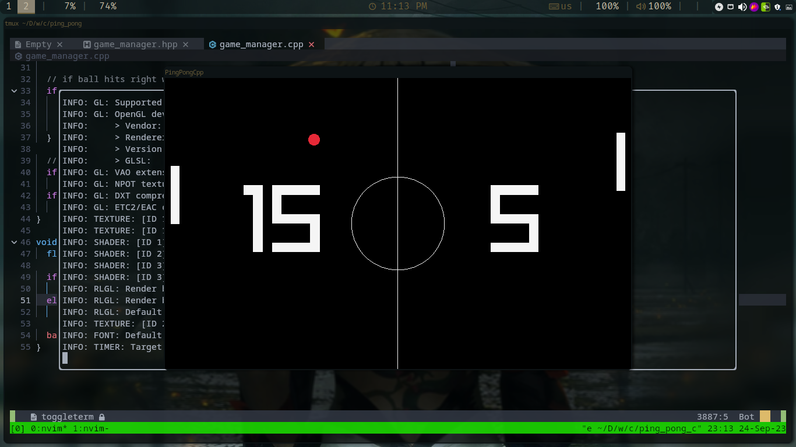

# Ping Pong CPP

- A ping pong game written in Cpp using RayLib



## How To Play

- Use the keys `K/Up` and `J/Down` to move **Up** and **Down**
- Use `Space` to reset the ball position and get the next shoot, **but it costs 1 point**.

## Build

- Make sure that RayLib is installed on your system then compile the project.

1. Create directory `build/`

```sh
$ mkdir -p build/
```

2. Compile the project by running `make` or `make run` to compile and run the project.

```sh
$ make
$ ./cping_pong
# OR
$ make run
```
